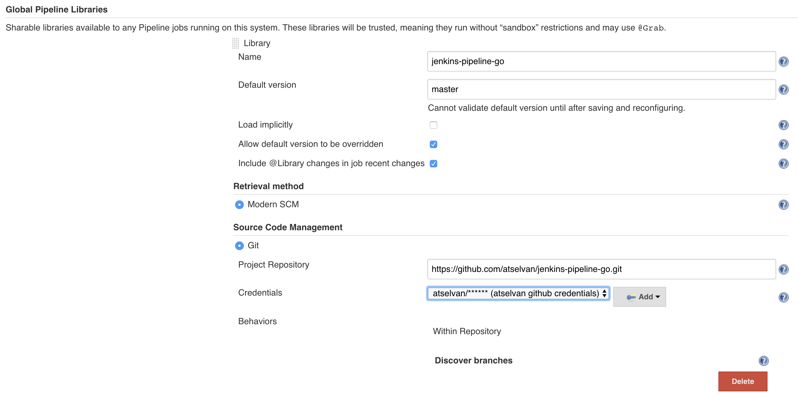

# Go pipeline

## Configure Shared library



## Usage

Add below line in your JenkinsFile to invoke the shared library

```Jenkinsfile
@Library(['jenkins-pipeline-go']) _
goPipeline()
```

And add a jenkins.yml-file (description in [Configuration](#Configuration))

## Project setup

We assume that if your groupId is ```com.privatesquare.go``` and your artificatId is ```myApplication```, then your application can be found in the folder ```src/com/privatesquare/go/myApplcation``` (relative to the rootfolder of your git-project).

## Configuration <a name="Configuration"></a>

|name|required|description|example
|---|---|---|---|
|groupId|yes|full qualified domain name of your project|com.privatesquare.go
|artifactId|yes|name of your application|jenkins-ci
|version|yes|major.minor.increment|1.0.0

Example: [jenkins.yml](./docs/jenkins.yml)

[Reference](https://jenkins.io/doc/book/pipeline/shared-libraries/)